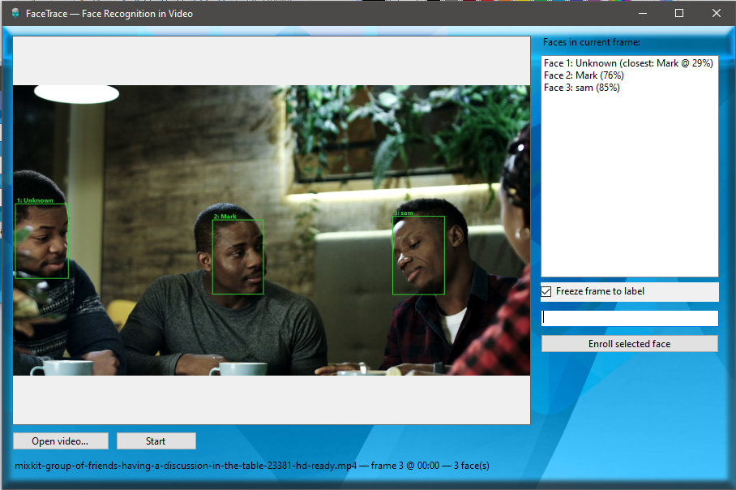
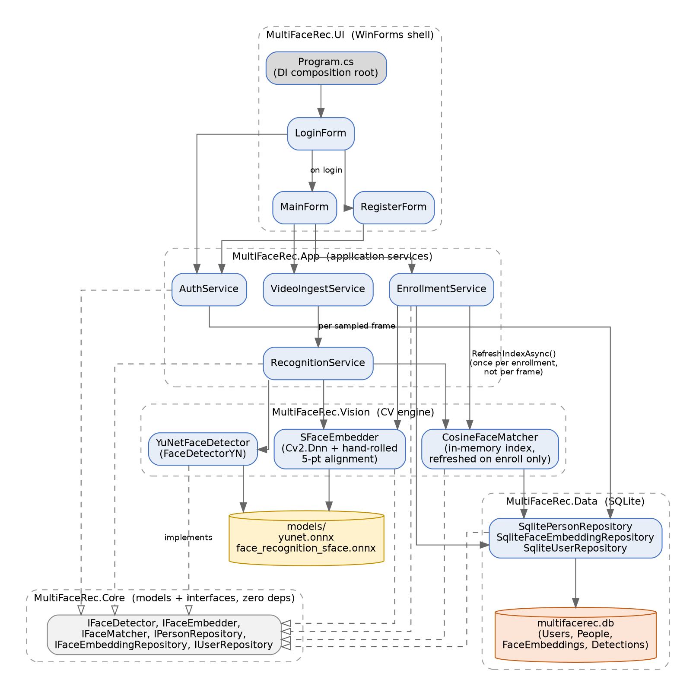

<div align="center">

# FaceTrace

**Face detection and recognition in video — built on YuNet, SFace, and .NET 8**

Upload a video, detect every face in it, and label who's who — with the labels remembered for next time.

[](https://dotnet.microsoft.com/)
[](https://learn.microsoft.com/dotnet/desktop/winforms/)
[](https://github.com/shimat/opencvsharp)
[](https://www.sqlite.org/)
[](#license)

</div>

---


## What it does

FaceTrace loads a video file, runs face detection on it frame by frame, and shows every detected face with a bounding box. Pick any face from the list, type a name, and enroll it — from then on, that person is recognized automatically wherever they reappear in the video.

Architecture components of FaceTrace are YuNet, SFace embeddings, SQLite, BCrypt-hashed accounts.

## Features

- 🎯 **Modern face detection** — [YuNet](https://github.com/opencv/opencv_zoo/tree/main/models/face_detection_yunet), a small fast ONNX detector, handles varied pose and lighting far better than a Haar cascade
- 🧠 **Real face recognition** — [SFace](https://github.com/opencv/opencv_zoo/tree/main/models/face_recognition_sface) embeddings compared by cosine similarity, not raw pixel distance
- 🖱️ **Pick-and-label UI** — every detected face in a frame is listed and clickable, with the selected box highlighted directly on the video frame
- ⏸️ **Freeze-frame enrollment** — pause the exact frame you want before assigning a name, so a moving video can't yank the selection out from under you
- 🔒 **Real authentication** — local accounts with BCrypt-hashed passwords, not a plaintext registry key
- 🗄️ **Real storage** — SQLite, with proper tables for people, embeddings, and detection history — not `.bmp` files and a `%`-delimited text file
- ⚡ **Non-blocking video pipeline** — decoding, detection, and recognition run on a background task and stream results through a bounded channel, so the UI never freezes on a slow frame

## Screenshot


<div align="center">



</div>


## Architecture

FaceTrace is split into five layered projects, each depending only on the layer(s) beneath it. `Core` has zero external dependencies — everything else (the detector, the database, the UI framework) can be swapped without the layers above it knowing.



| Project | Responsibility |
|---|---|
| **`MultiFaceRec.Core`** | Domain models (`Person`, `FaceEmbedding`, `DetectedFace`, `UserAccount`) and interfaces (`IFaceDetector`, `IFaceEmbedder`, `IFaceMatcher`, repository interfaces). No package dependencies. |
| **`MultiFaceRec.Vision`** | `YuNetFaceDetector`, `SFaceEmbedder`, `CosineFaceMatcher` — the only project that talks to OpenCvSharp4 directly. |
| **`MultiFaceRec.Data`** | SQLite schema + repository implementations. |
| **`MultiFaceRec.App`** | `AuthService`, `EnrollmentService`, `RecognitionService`, `VideoIngestService` — the actual application logic. |
| **`MultiFaceRec.UI`** | WinForms shell (Login, Register, Main) + the DI composition root. Thin by design. |
| **`MultiFaceRec.Tests`** | xUnit + Moq tests for the logic that doesn't need a GUI or native OpenCV. |

## Tech stack

| Layer | Technology |
|---|---|
| Language / runtime | C# 12, .NET 8 |
| UI | Windows Forms |
| Face detection | `FaceDetectorYN` (YuNet) via OpenCvSharp4 |
| Face recognition | SFace ONNX model, run via `Cv2.Dnn` with hand-rolled 5-point alignment |
| Matching | In-memory cosine similarity, index rebuilt only on enrollment |
| Video decoding | OpenCvSharp4 `VideoCapture`, on a background task |
| Storage | SQLite via `Microsoft.Data.Sqlite` |
| Auth | `BCrypt.Net-Next` password hashing |
| Concurrency | `System.Threading.Channels` (bounded, drop-oldest) |
| DI / config | `Microsoft.Extensions.DependencyInjection` + `Microsoft.Extensions.Configuration` |

## Getting started

### Prerequisites

- [.NET 8 SDK](https://dotnet.microsoft.com/download/dotnet/8.0)
- Visual Studio 2022+ (or your editor of choice) — Windows only, since WinForms + the OpenCvSharp Windows runtime are Windows-specific
- Two ONNX model files from the [OpenCV Zoo](https://github.com/opencv/opencv_zoo) (not included in this repo — see below)

### 1. Clone and restore

```bash
git clone https://github.com/uvaisebasheer/FaceTrace.git
cd FaceTrace
dotnet restore
```

### 2. Download the models

Grab these two files from the OpenCV Zoo and place them in `models/`:

| File | Source folder in [opencv_zoo](https://github.com/opencv/opencv_zoo) |
|---|---|
| `yunet.onnx` | `models/face_detection_yunet/` |
| `face_recognition_sface.onnx` | `models/face_recognition_sface/` |

See [`models/README.md`](models/README.md) for exact filenames.

### 3. Build and run

```bash
dotnet build -c Release
dotnet run --project src/MultiFaceRec.UI
```

On first launch, you'll be prompted to create a local account (username + password, BCrypt-hashed — no more plaintext-in-the-registry). Then:

1. **Open video…** and pick a file
2. **Start** to begin detection
3. Check **Freeze frame to label**, pick a face from the list, type a name, **Enroll selected face**
4. Uncheck freeze and watch that person get recognized automatically from then on

## Configuration

All of it lives in `src/MultiFaceRec.UI/appsettings.json`:

```json
{
  "Database": { "Path": "multifacerec.db" },
  "Models": {
    "YuNetPath": "../../../models/yunet.onnx",
    "SFacePath": "../../../models/face_recognition_sface.onnx"
  },
  "Detection": { "ScoreThreshold": 0.8, "NmsThreshold": 0.3 },
  "Recognition": { "SimilarityThreshold": 0.5, "DebugSaveAlignedCropsTo": "" },
  "Video": { "TargetFps": 8 }
}
```

| Setting | What it controls |
|---|---|
| `Detection:ScoreThreshold` | Minimum detector confidence to keep a face box, 0–1 |
| `Recognition:SimilarityThreshold` | Minimum cosine similarity to count as a recognized match |
| `Video:TargetFps` | How many frames per second to actually process (frames in between are skipped) |
| `Recognition:DebugSaveAlignedCropsTo` | Set to a folder path to dump aligned face crops + similarity logs for debugging recognition quality — see below |

### Debugging recognition quality

Setting `DebugSaveAlignedCropsTo` to a folder turns on three diagnostics:

- `crop_*.png` — every aligned 112×112 face crop fed to the recognizer
- `landmarks_*.png` — the 5 detected landmark points drawn on the source face, to sanity-check alignment
- `pairwise_similarity_log.txt` — cosine similarity between every pair of faces detected in the *same* frame (guaranteed different people), the most direct test of whether recognition is actually discriminating between individuals

Turn it back off (`""`) for normal use — it writes a file per processed face.

## Project layout

```
FaceTrace/
├── models/                         # yunet.onnx + face_recognition_sface.onnx go here (not tracked)
├── docs/ 
├── src/
│   ├── MultiFaceRec.Core/
│   ├── MultiFaceRec.Vision/
│   ├── MultiFaceRec.Data/
│   ├── MultiFaceRec.App/
│   ├── MultiFaceRec.UI/
│   └── MultiFaceRec.Tests/
└── FaceTrace.sln
```

## Testing

```bash
dotnet test
```

Covers `CosineFaceMatcher` (nearest-match logic, threshold behavior, index refresh) and `AuthService` (registration validation, password hashing, login). The OpenCvSharp-dependent classes and the WinForms UI aren't unit tested — see the tests README section for why.

## Roadmap / known limitations

- No vector index (FAISS/pgvector) — fine up to a few thousand enrolled faces, worth revisiting beyond that
- No login rate-limiting / account lockout
- Single schema script rather than a real migration framework (fine for a single-user desktop app)
- One video stream at a time — no concurrent multi-video processing

## Contributing

Issues and PRs welcome. If you're touching `MultiFaceRec.Vision`, please test against real footage — several past bugs here (see commit history) only ever showed up with real faces, never in isolated unit tests.


## 👨‍💻 Author

**Uvaise K B**
- Full Stack Developer | Co-Founder @ CyberSyon Softwares
- 8+ years building fintech & payment platforms
- 📧 uvaise.basheer@gmail.com
- 📍 Kochi, Kerala, India
- 🔗 [LinkedIn](https://linkedin.com/in/uvaisebasheer)

---

## 📄 License

Distributed under the MIT License. See `LICENSE` for details.

---

<div align="center">

**⭐ Star this repo if you found it helpful!**

Built with ❤️ in Kerala, India

</div>
